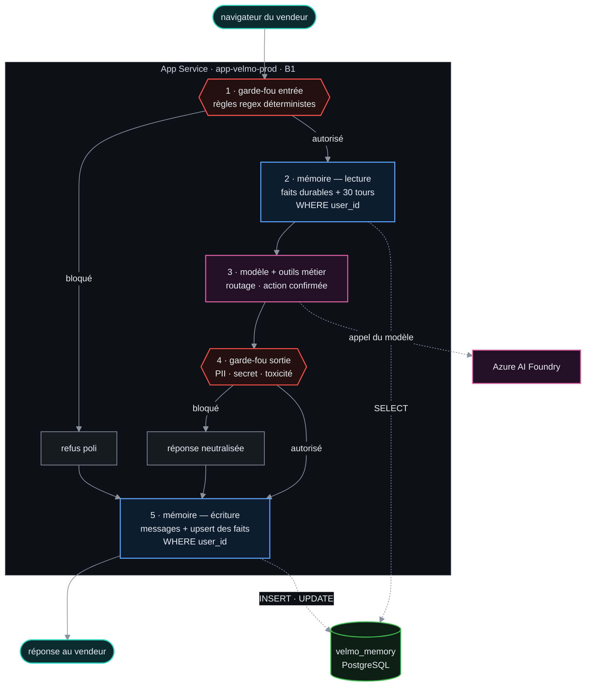
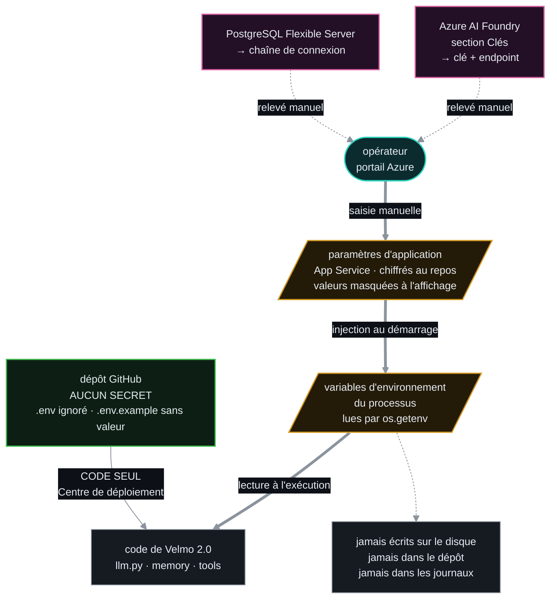
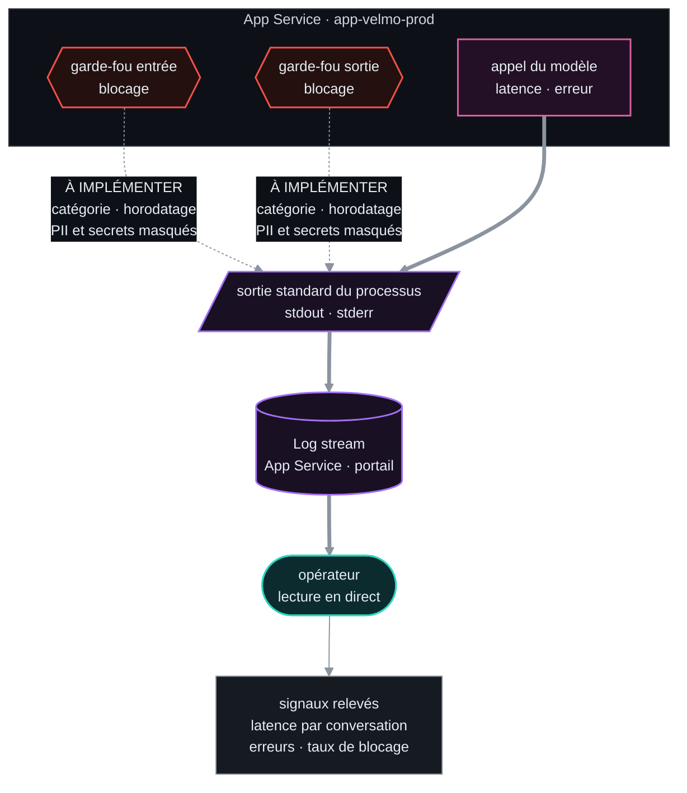
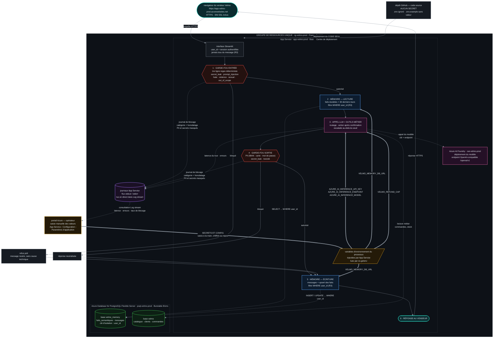

# 3. Schéma de déploiement cible

> Attendu du brief : concevoir le schéma de déploiement Azure correspondant à l'architecture de
> Velmo 2.0, en préservant la chaîne garde-fous vers mémoire vers LLM.
> Le schéma doit indiquer **où passent les secrets** et **où sont lus et écrits les journaux**.

Ce schéma est la **traduction Azure** du schéma d'architecture global de Velmo 2.0
(`TP7/dossier-conception/00-architecture-globale.md` §1), et non une architecture nouvelle.
L'ordre des six étapes est repris à l'identique.

Sources éditables : les quatre fichiers `.mermaid` de [`diagrammes/`](diagrammes/) (format Mermaid,
comme les diagrammes existants du projet ; collables dans `mermaid.live`). Les images vectorielles
correspondantes sont dans [`diagrammes/svg/`](diagrammes/svg/), produites par l'outil documenté dans
[`diagrammes/outils/README.md`](diagrammes/outils/README.md).
Une version en boîtes ASCII est fournie au §3.3, lisible sans aucun outil.

---

## 3.1 Chaîne de traitement imposée

L'ordre suivant est dicté par le brief et **ne doit pas être modifié** au passage en ligne :

```
navigateur
  -> hébergement Azure (App Service)
       -> garde-fou d'entrée
       -> lecture mémoire
       -> Azure OpenAI
       -> garde-fou de sortie
       -> écriture mémoire
  -> stockage mémoire persistant
```

**Vérification faite dans le code** : cet ordre est déjà celui de `agent.py`, méthode `_respond`.

| Étape du brief      | Emplacement dans le code                      | Ligne          |
| ------------------- | --------------------------------------------- | -------------- |
| Garde-fou d'entrée  | `self.guardrails.check_input(message)`        | `agent.py:112` |
| Lecture mémoire     | `self.memory.read(user_id, message)`          | `agent.py:125` |
| LLM et outils       | `self._handle(user_id, message, context)`     | `agent.py:135` |
| Garde-fou de sortie | `self.guardrails.check_output(answer, ...)`   | `agent.py:148` |
| Écriture mémoire    | `self.memory.write(user_id, message, answer)` | `agent.py:157` |

Le déploiement ne change donc **aucune** de ces étapes : il ne fait que remplacer les substrats
(fichier SQLite vers base managée, fournisseur LLM vers Azure AI Foundry).

Deux comportements du code à faire figurer, car ils écartent des erreurs de lecture du schéma :

- **Un refus est mémorisé.** Si le garde-fou d'entrée bloque, l'agent écrit quand même l'échange en
  mémoire avant de répondre (`agent.py:118`). La branche « bloqué » rejoint donc l'étape 5.
- **Le garde-fou de sortie neutralise, il n'interrompt pas.** En cas de blocage, la réponse est
  remplacée par un message de refus (`agent.py:151-154`), puis le flux continue normalement vers
  l'écriture mémoire.

## 3.2 Schémas cibles

Le brief demande d'indiquer sur le schéma la chaîne de traitement, **où passent les secrets** et
**où sont lus et écrits les journaux**. Réunir ces trois flux sur une seule image donne un schéma de
vingt-deux nœuds que personne ne lit en soutenance. Il y a donc **une vue par question**, et une
vue complète en annexe pour la conformité au brief.

| Vue | Question à laquelle elle répond             | Source éditable                         |
| --- | ------------------------------------------- | --------------------------------------- |
| 1   | Que traverse un message, dans quel ordre ?  | `diagrammes/01-flux-requete.mermaid`    |
| 2   | D'où viennent les secrets, où vont-ils ?    | `diagrammes/02-trajet-secrets.mermaid`  |
| 3   | Qu'écrit-on, et où le lit-on ?              | `diagrammes/03-trajet-journaux.mermaid` |
| 4   | Les trois flux sur une seule image (annexe) | `diagrammes/04-schema-complet.mermaid`  |

Chaque vue existe sous trois formes, et l'ordre de préséance importe :

| Forme              | Emplacement             | Usage                                                     |
| ------------------ | ----------------------- | --------------------------------------------------------- |
| **source mermaid** | `diagrammes/*.mermaid`  | **fait référence** — c'est ce qu'on modifie               |
| image vectorielle  | `diagrammes/svg/*.svg`  | à insérer dans un document, une capture, une présentation |
| bloc recopié       | ce document, ci-dessous | lecture directe du dossier                                |

Les `.svg` sont **produits** à partir des sources, jamais édités à la main :
`diagrammes/outils/README.md` donne la commande. Après toute modification d'un schéma, régénérer —
sinon les `.svg` mentent. En cas de divergence après un retour du formateur, corriger le `.mermaid`,
régénérer, puis reporter le bloc ici.

### Vue 1 — Le trajet d'une requête

L'ordre des cinq étapes est celui du brief, et il est déjà celui du code (`agent.py:111-157`). Deux
détails que le schéma rend visibles et qu'on oublie souvent : un message **bloqué** en entrée est
**quand même écrit en mémoire** (les deux chemins de refus rejoignent l'étape 5), et le garde-fou de
sortie **neutralise** la réponse au lieu d'interrompre le flux.



### Vue 2 — Le trajet des secrets

C'est la vue qui répond au critère le plus explicite du brief. Ce qu'il faut y lire en premier n'est
pas une flèche présente, mais une flèche **absente** : rien ne relie le dépôt Git aux secrets. Le
dépôt ne transporte que du code.



### Vue 3 — Le trajet des journaux

Cette vue porte une information désagréable, et c'est exactement pourquoi elle mérite un schéma à
elle : **les deux flèches venant des garde-fous n'existent pas encore.** Aujourd'hui les blocages ne
vivent que dans une liste en mémoire (§3.5). Sans cette adaptation, le point 7 du brief — constater
le blocage **et sa journalisation** — n'est pas démontrable en ligne.



### Vue 4 — Annexe : les trois flux sur une seule image

Source : `diagrammes/04-schema-complet.mermaid`. Vingt-deux nœuds : cette vue existe pour deux usages
précis — la capture à joindre aux livrables, et la démonstration que la chaîne, les secrets et les
journaux tiennent bien dans un **groupe de ressources unique**, celui qu'on pourra supprimer d'un
seul geste à la fin du brief. Pour **expliquer**, préférer les trois vues précédentes.



### Convention de couleurs

Reprise à l'identique dans les quatre vues, pour qu'un même rôle ait toujours la même teinte.

| Teinte de bordure | Rôle              | Forme du nœud                    |
| ----------------- | ----------------- | -------------------------------- |
| teal              | entrée et sortie  | rectangle arrondi                |
| rouge brique      | garde-fou         | hexagone (point de contrôle)     |
| bleu ardoise      | mémoire           | rectangle                        |
| vert-de-gris      | stockage durable  | cylindre                         |
| ambre             | porteur de secret | parallélogramme                  |
| violet            | journaux          | cylindre (journaux) ou rectangle |
| rose              | service d'IA      | rectangle                        |

Les formes portent l'information autant que les couleurs : le schéma reste lisible imprimé en
niveaux de gris.

## 3.3 Même schéma en boîtes ASCII

Version lisible sans outil, dans la convention du dossier de conception existant.

```text
   [ Dépôt GitHub ]                                    [ Portail Azure - opérateur ]
   code source, AUCUN secret                           saisie des secrets à la main
   .env ignoré                                         App Service > Configuration
          │                                                        │
          │ déploiement du CODE SEUL                               │ SECRETS + CONFIG
          │ (Centre de déploiement)                                │ (chiffrés au repos)
          ▼                                                        ▼
╔══════════════════════════════════════════════════════════════════════════════════════╗
║  GROUPE DE RESSOURCES UNIQUE : rg-velmo-prod          (région France Central)         ║
║                                                                                       ║
║  ┌─────────────────────────────────────────────────────────────────────────────────┐ ║
║  │ APP SERVICE  app-velmo-prod   ·  Plan Basic B1  ·  Python 3.11                │ ║
║  │                                                                                 │ ║
║  │   ┌───────────────────────────────────────────────────────────────┐             │ ║
║  │   │ Paramètres d'application  ->  VARIABLES D'ENVIRONNEMENT        │◀── secrets  │ ║
║  │   │ lues par os.getenv — jamais écrites sur disque, jamais en Git │             │ ║
║  │   └───────┬───────────────┬───────────────────────┬───────────────┘             │ ║
║  │           │ clé+endpoint  │ VELMO_MEMORY_DB_URL   │ VELMO_REFUND_CAP            │ ║
║  │           ▼               ▼                       ▼                             │ ║
║  │  Interface Streamlit — user_id = SESSION AUTHENTIFIÉE (jamais le message, R3)   │ ║
║  │           │                                                                     │ ║
║  │           ▼                                                                     │ ║
║  │   1 · GARDE-FOU ENTRÉE ────── bloqué ──▶ Refus poli ──┐        ....journal....▶  │ ║
║  │           │ autorisé                                   │                        │ ║
║  │           ▼                                            │                        │ ║
║  │   2 · MÉMOIRE LECTURE  ....SELECT WHERE user_id....▶   │                        │ ║
║  │           │                                            │                        │ ║
║  │           ▼                                            │                        │ ║
║  │   3 · LLM + OUTILS  ....appel du modèle....▶           │        ....journal....▶ │ ║
║  │           │                                            │        (latence,erreur) │ ║
║  │           ▼                                            │                        │ ║
║  │   4 · GARDE-FOU SORTIE ───── bloqué ──▶ Neutralisée ──┤        ....journal....▶  │ ║
║  │           │ autorisé                                   │                        │ ║
║  │           ▼                                            │                        │ ║
║  │   5 · MÉMOIRE ÉCRITURE ◀───────────────────────────────┘                        │ ║
║  │           │             ....INSERT/UPDATE WHERE user_id....▶                    │ ║
║  │           ▼                                                                     │ ║
║  │   6 · RÉPONSE AU VENDEUR                                                        │ ║
║  └─────────────────────────────────────────────────────────────────────────────────┘ ║
║           │                        │                             │                   ║
║           ▼                        ▼                             ▼                   ║
║  ┌──────────────────┐   ┌────────────────────────┐   ┌──────────────────────────┐    ║
║  │ AZURE AI FOUNDRY │   │ POSTGRESQL FLEXIBLE    │   │ JOURNAUX App Service     │    ║
║  │ oai-velmo-prod   │   │ SERVER psql-velmo-prod │   │ flux stdout / stderr     │    ║
║  │ modèle déployé   │   │ Burstable B1ms         │   │                          │    ║
║  │ endpoint         │   │ ┌────────────────────┐ │   │ blocages garde-fous      │    ║
║  │ /openai/v1       │   │ │ base velmo_memory  │ │   │ (PII/secrets MASQUÉS)    │    ║
║  │                  │   │ │ faits_semantiques  │ │   │ latence · erreurs        │    ║
║  │                  │   │ │ messages           │ │   │                          │    ║
║  │                  │   │ │ clé : user_id (R3) │ │   │ lus dans LOG STREAM ─────┼───▶║ opérateur
║  │                  │   │ ├────────────────────┤ │   │                          │    ║
║  │                  │   │ │ base velmo (métier)│ │   │                          │    ║
║  │                  │   │ └────────────────────┘ │   │                          │    ║
║  └──────────────────┘   └────────────────────────┘   └──────────────────────────┘    ║
╚═══════════════════════════════════════════════════════════════════════════════════════╝

Légende :  ───▶  flux de la requête        ....▶  accès stockage / secrets / journaux
```

## 3.4 Le trajet des secrets

Exigence explicite du brief. La règle tient en une phrase : **les secrets ne traversent jamais le
dépôt Git ; ils entrent par le portail et n'existent qu'en mémoire du processus.**

| Étape        | Ce qui se passe                                                                                                 | Garantie                                      |
| ------------ | --------------------------------------------------------------------------------------------------------------- | --------------------------------------------- |
| 1. Origine   | La clé est générée par Azure AI Foundry ; les mots de passe de base le sont à la création du serveur PostgreSQL | Les valeurs n'existent que côté Azure         |
| 2. Saisie    | L'opérateur les copie dans **App Service > Configuration > Paramètres d'application**                           | Saisie manuelle, hors de tout fichier         |
| 3. Stockage  | Azure conserve les paramètres d'application **chiffrés au repos**                                               | Hors du dépôt, hors du code                   |
| 4. Injection | Au démarrage, App Service les expose comme **variables d'environnement** du processus                           | Jamais écrites sur le disque de l'application |
| 5. Lecture   | Le code les lit par `os.getenv` / `os.environ` (`llm.py:68,84,86`, `db.py:168`)                                 | Code identique en local et en ligne           |
| 6. Usage     | Clé et endpoint vers Azure AI Foundry ; chaînes de connexion vers PostgreSQL                                    | Utilisées, jamais restituées                  |

**Ce qui, à l'inverse, ne contient aucun secret** : le dépôt GitHub (`.env` ignoré,
`.gitignore:24`, aucun secret dans l'historique — vérifié), les réponses de l'agent (le garde-fou de
sortie bloque la catégorie `secret_leak`), les messages d'erreur (repli `TECHNICAL_FALLBACK`,
`agent.py:38-42`, qui n'expose jamais la cause technique) et les journaux (masquage `"[masqué]"`
pour `pii` et `secret_leak`, `guardrails/__init__.py:170`).

Détail de l'inventaire : voir `02-secrets-et-config.md`.

## 3.5 Le trajet des journaux

Exigence explicite du brief. Trois points d'écriture, un point de lecture.

| Point d'écriture     | Moment dans la chaîne     | Contenu                                                              | Utilité (point 8 du brief)        |
| -------------------- | ------------------------- | -------------------------------------------------------------------- | --------------------------------- |
| Garde-fou d'entrée   | Étape 1, à chaque blocage | Catégorie, horodatage ; extrait **masqué** si `pii` ou `secret_leak` | Taux de blocage en entrée         |
| Garde-fou de sortie  | Étape 4, à chaque blocage | Idem                                                                 | Taux de blocage en sortie         |
| Tour de conversation | Autour des étapes 2 à 5   | Durée du tour, erreurs techniques                                    | Latence par conversation, erreurs |

**Point de lecture unique** : **Log stream** de l'App Service, dans le portail
(`app-velmo-prod` > Log stream), conformément à la ressource formateur.

### Adaptation de code nécessaire

Aujourd'hui, les blocages sont enregistrés dans une **liste en mémoire**
(`GuardrailEngine.events`, `guardrails/__init__.py:161-171`). Cette liste **disparaît au
redémarrage** et **n'apparaît pas** dans le Log stream, qui ne montre que les flux `stdout` et
`stderr` du processus.

Pour que le point 7 (« constater le blocage **et la journalisation** ») et le point 8 soient
réellement démontrables en ligne, il faut **émettre aussi chaque événement sur la sortie
standard**, via le module `logging` de Python. La liste `events` est conservée telle quelle : elle
sert aux tests d'acceptance et au panneau de démonstration.

Ligne de journal envisagée, sans donnée sensible :

```
INFO velmo.guardrails blocage where=input category=prompt_injection method=rules user=<user_id>
```

Le `user_id` est un identifiant interne (`C-marc-dubois`), pas une donnée personnelle directe ; il
est nécessaire pour rattacher un blocage à une conversation.

## 3.6 Correspondance avec l'architecture locale

Tableau de traçabilité : montrer que rien n'est perdu au passage en ligne. Verdict d'abord, les
écarts qui demandent une explication sont détaillés sous le tableau.

| Composant en local                        | Équivalent en ligne                     | Écart                      |
| ----------------------------------------- | --------------------------------------- | -------------------------- |
| Serveur local (`streamlit run`)           | App Service `app-velmo-prod`, B1        | aucun (a)                  |
| Appel au fournisseur LLM                  | Azure AI Foundry `oai-velmo-prod`       | aucun (b)                  |
| Fil de conversation (`messages`)          | Base `velmo_memory` sur PostgreSQL      | substrat seul              |
| Mémoire long terme (`faits_semantiques`)  | Base `velmo_memory` sur PostgreSQL      | **voulu par le brief** (c) |
| Base métier (Postgres local)              | Base `velmo`, même serveur              | mutualisation (d)          |
| Garde-fou d'entrée (`check_input`)        | identique, dans l'App Service           | aucune dégradation (e)     |
| Garde-fou de sortie (`check_output`)      | identique, dans l'App Service           | aucune dégradation (f)     |
| Journalisation (`GuardrailEngine.events`) | `events` **plus** émission sur `stdout` | ajout, pas retrait (g)     |
| FAQ par recherche sémantique              | repli lexical `LocalKB`                 | seul retrait assumé (h)    |
| Observabilité Langfuse                    | non activée                             | hors périmètre (i)         |
| Évaluation et porte qualité               | inchangées, hors App Service            | aucun (j)                  |

**(a)** Always On évite le démarrage à froid. Le CLI n'est pas déployé : seule l'interface web l'est.

**(b)** Le code attend déjà un endpoint OpenAI-compatible `/openai/v1` (`llm.py:84`). Seuls
l'endpoint, la clé et le nom de déploiement changent.

**(c)** C'est l'écart que le brief demande : le stockage devient externe, durable et partagé (R2).
L'isolation R3 est inchangée — elle reste portée par le filtre `user_id` du code, pas par le service.

**(d)** Un seul serveur pour deux bases, afin de limiter le coût. Les bases restent distinctes.

**(e)** Règles regex en code, non externalisées, donc non désactivables par un message.

**(f)** Idem, avec une nuance : le LLM-juge de 2e ligne s'activera en ligne
(`02-secrets-et-config.md`, décision 1).

**(g)** La liste en mémoire reste ; on y ajoute l'émission sur la sortie standard (§3.5).

**(h)** Justifié en `01-choix-services.md` §1.1 : hors des trois exigences, incompatible avec 1,75 Go
de RAM. **La FAQ n'est pas perdue** (`kb_store.py:34-58` et `107-118`), seule la tolérance aux
paraphrases l'est. **Condition** : `kb/docs/` doit être déployé, sinon la FAQ est silencieusement vide.

**(i)** Service tiers hors périmètre, remplacé par le Log stream conformément au brief.

**(j)** La chaîne qualité reste locale ou en intégration continue ; elle n'a pas à tourner en
production.

**Écart corrigé depuis le dossier de conception** : `diagrammes.md` signalait que le résultat de
`memory.read` n'était pas injecté dans le prompt. Ce n'est plus le cas : le contexte est transmis à
`_handle` puis rendu dans le prompt (`agent.py:125`, `agent.py:230-234`). La chaîne mémoire est donc
bien complète, en local comme en ligne.

## 3.7 Points de contrôle avant soumission au formateur

| Point                                                                         | Vérifié                                                                                             |
| ----------------------------------------------------------------------------- | --------------------------------------------------------------------------------------------------- |
| Les cinq étapes de la chaîne apparaissent dans le bon ordre                   | oui (§3.1, tracé dans `agent.py`)                                                                   |
| Le garde-fou d'entrée est bien avant tout appel au LLM                        | oui (`agent.py:112` avant `agent.py:135`)                                                           |
| L'écriture mémoire est bien après le garde-fou de sortie                      | oui (`agent.py:148` puis `agent.py:157`)                                                            |
| Le stockage mémoire est externe à l'hébergement, donc survit à un redémarrage | oui (PostgreSQL Flexible Server, ressource distincte)                                               |
| L'isolation par utilisateur est visible sur le schéma                         | oui (`user_id` porté sur la base et sur les deux étapes mémoire)                                    |
| Le trajet des secrets est tracé et ne traverse jamais le dépôt Git            | oui (§3.4)                                                                                          |
| Les points de journalisation sont indiqués                                    | oui (§3.5, trois points d'écriture, lecture en Log stream)                                          |
| Toutes les ressources sont dans un groupe de ressources unique                | oui (cadre `rg-velmo-prod`)                                                                         |
| Aucun service hors périmètre n'apparaît (`CONTEXT.md` §3)                     | oui                                                                                                 |
| Une version **source** du schéma est conservée, pas seulement une image       | oui (quatre `.mermaid` dans `diagrammes/`, images vectorielles produites dans `diagrammes/svg/`)    |
| Émission des blocages sur `stdout` pour le Log stream                         | **à implémenter** (§3.5)                                                                            |
| `kb/docs/` déployé et FAQ non vide en ligne                                   | **à contrôler au point 5** — aucune erreur n'est levée si le répertoire manque (§3.6)               |
| `DB_URL` et `VELMO_MEMORY_DB_URL` effectivement renseignées                   | **à contrôler au point 5** — `db.py:168` retombe silencieusement sur `localhost` si `DB_URL` manque |
